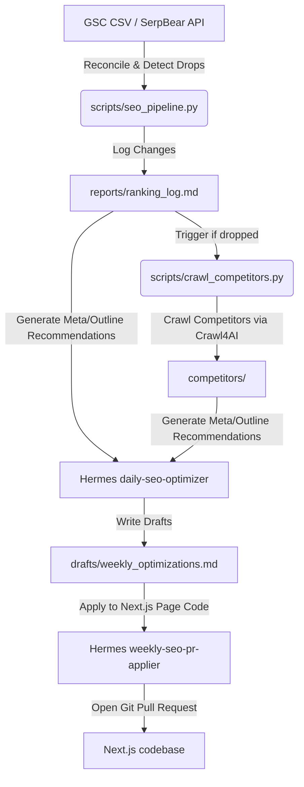

# Local SEO Automation Suite - Setup & Usage Guide

This report summarizes the self-hosted, low-cost local SEO automation system set up for **GoRentls**. The stack integrates **SerpBear** (for rank tracking), **Google Search Console** (for click/traffic data), **Crawl4AI** (for competitor web crawling), and **Hermes Agent** (for orchestration, optimization, and code deployment).

---

## 1. Architectural Overview

The automation suite is designed to run locally or on private server infrastructure to eliminate expensive third-party SEO subscription costs. It operates in four distinct phases:



---

## 2. Directory and File Structure

All automation files reside under `C:\Users\sunil\projects\gorentals\seo\`:

* **`data/`**: Storage for raw inputs. Contains `gsc_queries.csv` (manually or API-exported Google Search Console queries/impressions/CTR).
* **`reports/`**:
  * `ranking_log.md`: Chronological log of rank changes, traffic, and notes from scanning.
  * `homepage_seo_audit.md`: Current SEO audit of your live homepage.
* **`drafts/`**:
  * `weekly_optimizations.md`: Suggested meta tags (titles/descriptions under standard char limits), headings outlines, and content suggestions generated by Hermes.
* **`competitors/`**: Organizes crawled competitor page markdown files by `<cluster>/<keyword>/<date>/<hostname>.md`.
* **`scripts/`**:
  * [seo_pipeline.py](file:///C:/Users/sunil/projects/gorentals/seo/scripts/seo_pipeline.py): Orchestrates domain/keyword position extraction from SerpBear and reconciliation with GSC metrics.
  * [crawl_competitors.py](file:///C:/Users/sunil/projects/gorentals/seo/scripts/crawl_competitors.py): Spawns Crawl4AI's Playwright/Chromium engine to scrape competitor pages into clean markdown.
* **`target_keywords.md`**: Holds your master target keywords, clusters (cars, bikes, cameras, local), and landing page mappings.

---

## 3. Configuration Details

### Dependencies
Installed globally on your system Python environment (bypassing local policy restrictions on executable execution):
* **`crawl4ai`** (v0.9.0) & **`playwright`** (configured with the Chromium browser binary)
* **`requests`** (for SerpBear API calls)

### Hermes Profile (`rental-seo`)
An isolated profile was created to manage SEO tasks separate from standard development environments.
* Configured model: `nvidia/nemotron-3-ultra-550b-a55b`
* API credentials copied to: `C:\Users\sunil\AppData\Local\hermes\profiles\rental-seo\.env`

---

## 4. Hermes Cron Jobs (How they Work)

Four cron tasks are registered in Hermes to automate the workflow. You can view them by running `hermes cron list`.

1. **`daily-rank-scan` (Runs every 24 hours)**
   * *Command*: Executes `python seo/scripts/seo_pipeline.py` inside `C:\Users\sunil\projects\gorentals`.
   * *Outcome*: Fetches keyword rankings and matches them against `gsc_queries.csv`. Any drop of 2+ positions is logged with a warning in `ranking_log.md`.
2. **`competitor-crawler` (Runs every 3 days)**
   * *Command*: Reads `ranking_log.md`, finds keywords with ranking drops, searches for competitor links via Google, and runs `crawl_competitors.py` using Crawl4AI to save them.
3. **`daily-seo-optimizer` (Runs every 24 hours)**
   * *Command*: Reads `ranking_log.md` and competitor crawls to draft optimized meta tags (Title $\le$ 60 chars, Description $\le$ 155 chars) and outline recommendations into `weekly_optimizations.md`.
4. **`weekly-seo-pr-applier` (Runs every 7 days)**
   * *Command*: Locates the Next.js routes corresponding to the URLs listed in `weekly_optimizations.md` within `C:\Users\sunil\projects\gorentals`, updates metadata/headings, checks compilation (`npm run build`), and creates a Git branch/PR.

---

## 5. How to Use and Run the System

### Starting the Background Service
Because Hermes runs on your local machine, the background cron scheduler requires the **Hermes Gateway** to be running:
```powershell
# Install the gateway as a local user service
hermes gateway install

# To start it in the foreground for testing/debugging
hermes gateway
```

### Manual Executions & Testing
You can force-run any of the automated cron jobs immediately using the CLI:

```powershell
# Run the daily rank scanning and logging
hermes cron run daily-rank-scan

# Run the competitor crawler immediately
hermes cron run competitor-crawler

# Trigger the SEO optimizer to draft updates
hermes cron run daily-seo-optimizer
```

### Typical Daily Workflow
1. **Export GSC Data**: Once a week or daily, export your queries list from Google Search Console to `C:\Users\sunil\projects\gorentals\seo\data\gsc_queries.csv`.
2. **Read Ranking Logs**: Monitor `C:\Users\sunil\projects\gorentals\seo\reports\ranking_log.md` to see what is dropping or improving.
3. **Review Optimizations**: Open `C:\Users\sunil\projects\gorentals\seo\drafts\weekly_optimizations.md` to review the titles and headings drafted by Hermes.
4. **Merge Code Changes**: Check your local Git branches/GitHub PRs (generated by the PR-Applier cron) and merge the meta tag / content updates after reviewing the code changes.
